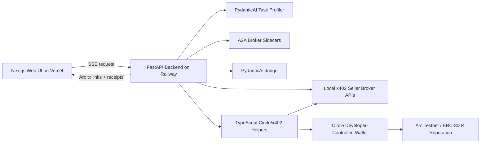

# Agentic Economy on Arc Backend

Railway backend for the **Agent-to-Agent Marketplace on Arc** hackathon submission.

This service runs the live PydanticAI + A2A orchestration and calls the TypeScript Circle/x402 helpers that execute the real sub-cent USDC payment and Arc reputation proof flow.

## Related Repository

- Web UI / Vercel repo: https://github.com/pktikkani/agentic-economy-on-arc
- Backend / Railway repo: https://github.com/pktikkani/agentic-economy-on-arc-backend

Mention both repositories in the hackathon submission README/repository field.

## What This Service Does

- Starts broker assessment sidecars using A2A protocol wrappers.
- Starts the local x402 seller broker APIs inside the backend container.
- Uses PydanticAI + Gemini 3 Flash for task profiling, broker selection, and judging.
- Calls Circle Developer-Controlled Wallet APIs for x402 payment signing and Arc contract execution.
- Writes ERC-8004 quality feedback to Arc testnet after each paid broker response.
- Streams `/demo/run` and `/fifty/run` Server-Sent Events to the web UI.

## Architecture



## Local Run

```bash
npm install
python3 -m venv .venv
. .venv/bin/activate
pip install -r backend/requirements.txt

python -m uvicorn backend.app:app --reload --host 127.0.0.1 --port 8000
```

The FastAPI process starts the broker seller APIs on ports `3001-3005` automatically, which is the same setup the Railway container uses.

Health check:

```bash
curl http://127.0.0.1:8000/health
```

## Railway Deploy

Use this repository root as the Railway project root.

Railway should use the included `Dockerfile`. Do not set the root directory to `backend/`; the Python service needs the TypeScript payment helpers in `src/` and `scripts/`.

Target port for the custom domain: `8080`.

Required environment variables:

```bash
GOOGLE_GENERATIVE_AI_API_KEY=
CIRCLE_API_KEY=
CIRCLE_ENTITY_SECRET=
CIRCLE_WALLET_SET_ID=
CIRCLE_WALLET_ID=
CIRCLE_WALLET_ADDRESS=
BROKER_A_PRIVATE_KEY=
BROKER_B_PRIVATE_KEY=
BROKER_C_PRIVATE_KEY=
BROKER_D_PRIVATE_KEY=
BROKER_E_PRIVATE_KEY=
ARC_RPC_URL=https://rpc.testnet.arc.network
ARC_CHAIN_ID=5042002
ARC_EXPLORER=https://testnet.arcscan.app
USDC_CONTRACT=0x3600000000000000000000000000000000000000
```

Optional broker ID overrides:

```bash
BROKER_AGENT_IDS_JSON={"A":"2424","B":"2425","C":"2426","D":"2427","E":"2428"}
```

The current code has these public Arc testnet broker IDs as defaults, so the override is only needed if you register a fresh broker set.

## Endpoints

- `GET /health`
- `GET /demo/run?tasks=1`
- `GET /fifty/run?total=50`

## Security

Do not commit `.env`, recovery files, `demo-output/`, `node_modules/`, or `.venv/`. The checked-in `.env.example` contains placeholders only.
